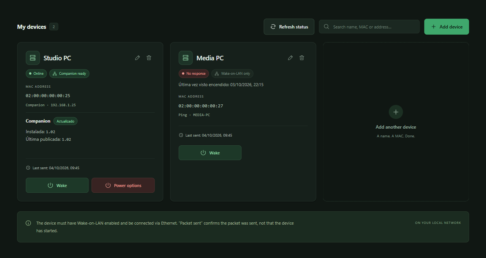
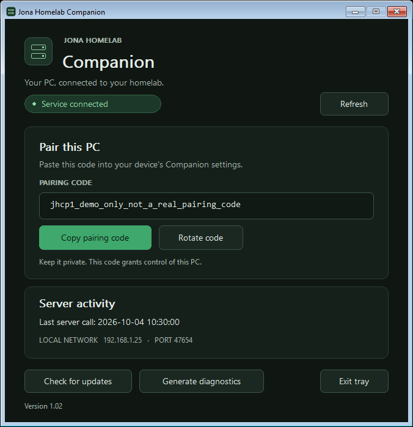
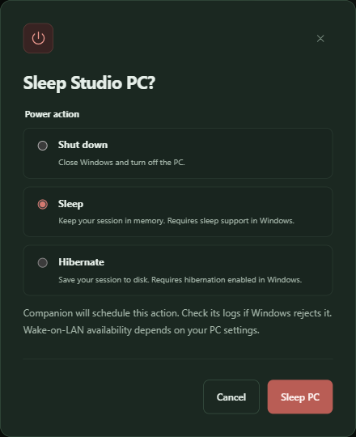

<p align="center">
  
</p>

<h1 align="center">Jona Homelab</h1>

<p align="center"><strong>Tu homelab, a un clic.</strong></p>
<p align="center">Enciende tus equipos y controla su energía desde un panel web privado.</p>

<p align="center">
  <a href="https://github.com/jonatancheca/jona-homelab/releases/latest">Descargar</a> ·
  <a href="#capturas">Capturas</a> ·
  <a href="#instalación">Instalación</a> ·
  <a href="companion/README.md">Guía de Companion</a> ·
  <a href="#desarrollo">Desarrollo</a>
</p>

Jona Homelab convierte un Ubuntu siempre encendido en el punto de control de los ordenadores de tu red. Abre el panel desde el móvil o el escritorio, consulta qué equipos responden y despiértalos con Wake-on-LAN. Con **Companion para Windows**, también puedes apagarlos, suspenderlos o hibernarlos.

## Capturas

### Tu red en una sola vista



<table>
  <tr>
    <th>Companion para Windows</th>
    <th>Opciones de energía en la web</th>
  </tr>
  <tr>
    <td valign="top"></td>
    <td valign="top"></td>
  </tr>
</table>

*Capturas de la aplicación con datos de demostración. Los nombres, direcciones y el código de emparejado son ficticios. La interfaz conserva sus textos actuales en inglés y español.*

## Qué puedes hacer

- **Guardar favoritos:** registra el nombre y la URL HTTP/HTTPS de tus servicios, edita o elimina sus accesos directos y ábrelos en otra pestaña. Se guardan en SQLite y están disponibles desde cualquier navegador del panel.
- **Despertar tus equipos:** envía Wake-on-LAN desde el navegador, también desde el móvil.
- **Consultar su estado:** comprueba conectividad y disponibilidad del control remoto; consulta cuándo se vio un equipo encendido por última vez.
- **Controlar Windows:** apaga, suspende o hiberna mediante Companion, con confirmación antes de ejecutar la acción.
- **Elegir cómo conectar:** usa Companion, una cuenta SSH restringida o solo Wake-on-LAN, según cada equipo.
- **Mantener Companion al día:** consulta su versión, solicita actualizaciones desde la web y genera diagnósticos desde su ventana.
- **Alojarlo en tu propia red:** panel Nuxt, SQLite integrada en Node y acceso remoto mediante Cloudflare Tunnel y Access.

## Cómo funciona

El navegador accede al dominio protegido por Cloudflare Access. Un Tunnel lo conecta con el panel alojado en Ubuntu; ese servidor envía los paquetes Wake-on-LAN y consulta los equipos dentro de su red local.

**El panel web** guarda dispositivos e historial en SQLite. **Companion** es un servicio de Windows 11 x64 con una ventana en la bandeja del sistema: copias su código de emparejado en el panel y queda listo para recibir órdenes autenticadas. El servicio funciona aunque no haya una sesión de Windows iniciada.

| Método por equipo | Encender | Consultar estado | Control de energía |
| --- | --- | --- | --- |
| Companion | Wake-on-LAN | Ping y API de Companion | Apagar, suspender e hibernar |
| SSH | Wake-on-LAN | Ping y autenticación SSH | Apagar |
| Solo Wake-on-LAN | Wake-on-LAN | Ping, si guardas una dirección | No disponible |

El encendido depende del hardware y de su configuración. Suspensión e hibernación requieren estados compatibles y habilitados en Windows.

<details>
<summary>Cómo interpretar el estado de los equipos</summary>

**Packet sent** confirma que el sistema operativo aceptó el paquete UDP; no confirma que el equipo haya arrancado. **Online** indica una respuesta positiva de ping, SSH o Companion. **No response** no demuestra que esté apagado.

El dato **Última vez visto encendido** se conserva en SQLite y se actualiza al comprobar el estado: cada 30 segundos mientras el panel está abierto o al refrescar manualmente. No es una monitorización continua en segundo plano. Enviar Wake-on-LAN no actualiza ese dato; cambiar la MAC o la dirección lo reinicia. Si nunca hubo una respuesta positiva, aparece **Sin registros**.

</details>

## Instalación

1. **Instala el panel en Ubuntu** con el paquete de la [última release](https://github.com/jonatancheca/jona-homelab/releases/latest).
2. **Configura el dominio, Tunnel y Access** para acceder al panel de forma privada.
3. **Añade tus equipos** con nombre y MAC. Para controlar Windows, instala Companion y pega su código de emparejado; también puedes elegir SSH o solo Wake-on-LAN.

Una instalación desde los paquetes publicados no necesita pnpm ni herramientas de compilación. El panel usa Node y SQLite; Companion es un ejecutable Go autocontenido, sin .NET. No se necesitan Docker, un servidor de base de datos independiente, Nginx ni PM2.

### Requisitos

- Ubuntu 26.04, Node **24 LTS ≥24.15**, `openssh-client`, `iputils-ping` y acceso a Internet para Cloudflare.
- Equipos en la misma subred IPv4, conectados por Ethernet, con alimentación y Wake-on-LAN habilitado en BIOS/UEFI y en el sistema operativo. Algunos equipos no despiertan desde apagado completo; revisa las opciones de ahorro de energía e inicio rápido del fabricante.
- Un dominio gestionado por Cloudflare, una aplicación Access y un Tunnel. No hay acceso directo por IP desde la LAN: usa el dominio protegido también desde casa.

<details>
<summary><strong>Instalar el panel en Ubuntu, paso a paso</strong></summary>

### 1. Preparar Node y elegir el paquete

Instala Node 24 LTS desde la [distribución oficial de Node](https://nodejs.org/en/download). Comprueba `node --version` y `command -v node`. La unidad incluida usa `/usr/bin/node`; si la ruta difiere, sustituye **solo `ExecStart`** por la ruta absoluta del binario de Node del sistema. Evita instalaciones bajo el directorio personal: el servicio no tiene acceso a `/home`.

Cada commit que llega a `main` genera además una release oficial `main-<sha>` desde GitHub Actions. La release contiene:

- `jona-homelab.tar.gz`: runtime de `.output`, `RELEASE_VERSION`, actualizador, README y archivos de despliegue.
- `jona-homelab.tar.gz.sha256`: checksum obligatorio del paquete.
- `update.sh`: copia independiente para incorporar el actualizador a instalaciones antiguas.
- `jona-homelab-companion-win-x64.zip`: servicio y bandeja Windows 11 x64 auto-contenidos.
- `jona-homelab-companion-win-x64.zip.sha256`: checksum del paquete Windows.

El paquete para Ubuntu se compila en Linux y no incluye Node. No hacen falta fuentes, pnpm ni herramientas de compilación en producción.

### 2. Usuario, archivos y configuración

Descarga y verifica la última release directamente en Ubuntu:

```sh
release_url=https://github.com/jonatancheca/jona-homelab/releases/latest/download
curl --fail --location --remote-name "$release_url/jona-homelab.tar.gz"
curl --fail --location --remote-name "$release_url/jona-homelab.tar.gz.sha256"
sha256sum --check jona-homelab.tar.gz.sha256
version="$(tar -xOf jona-homelab.tar.gz ./RELEASE_VERSION | tr -d '\r\n')"
printf '%s\n' "$version" | grep -Eq '^main-[0-9a-f]{12}$'
```

Después prepara instalación inicial. Si usuario o directorios ya existen, no los vuelvas a crear ni reemplaces configuración existente.

Si la aplicación ya está instalada, **no repitas esta instalación inicial ni borres lo existente**. Ve directamente a [Actualizaciones y rollback](#actualizaciones-y-rollback): el actualizador conserva base de datos, configuración, backups y releases anteriores.

```sh
sudo apt-get update
sudo apt-get install --yes openssh-client iputils-ping
id -u jona-homelab >/dev/null 2>&1 || sudo useradd --system --user-group --home-dir /var/lib/jona-homelab --no-create-home --shell /usr/sbin/nologin jona-homelab
sudo install -d -m 0755 /opt/jona-homelab/releases
sudo install -d -m 0755 "/opt/jona-homelab/releases/$version"
sudo tar -xzf jona-homelab.tar.gz -C "/opt/jona-homelab/releases/$version" --no-same-owner --no-same-permissions
sudo chmod -R a+rX "/opt/jona-homelab/releases/$version"
sudo chmod 0755 "/opt/jona-homelab/releases/$version/update.sh"
sudo ln -s "/opt/jona-homelab/releases/$version" /opt/jona-homelab/current
sudo install -m 0600 /opt/jona-homelab/current/deploy/homelab.env.example /etc/jona-homelab.env
sudo install -m 0644 /opt/jona-homelab/current/deploy/jona-homelab.service /etc/systemd/system/jona-homelab.service
sudoedit /etc/jona-homelab.env
```

Si el usuario ya existe, no vuelvas a crearlo. Los comandos de instalación de configuración son **solo para la primera instalación**: nunca sobreescribas el archivo existente durante una actualización.

`DB_PATH` apunta al archivo persistente; systemd crea `/var/lib/jona-homelab` con permisos privados. No guardes secretos ni la SQLite dentro del repositorio o del directorio de versiones.

`WOL_BROADCAST` vale `255.255.255.255` por defecto. Si el servidor tiene varias interfaces, establece el broadcast correcto de la subred y `WOL_SOURCE_IP` con la IP IPv4 local de la interfaz LAN; puedes consultarlos con `ip -4 addr`. No pongas `eth0` en esa variable. `WOL_PORT` vale `9`. No abras ni reenvíes ese puerto desde Internet.

`SSH_IDENTITY_FILE` y `SSH_KNOWN_HOSTS_FILE` deben ser rutas absolutas y configurarse juntas. Si se omiten, ping sigue disponible, pero SSH y apagado quedan desactivados. El servicio nunca acepta una clave de host desconocida ni usa contraseña.

### 3. Arrancar y comprobar

```sh
sudo systemctl daemon-reload
sudo systemctl enable --now jona-homelab
sudo systemctl status jona-homelab --no-pager
curl --fail http://127.0.0.1:3000/api/health
curl -i http://127.0.0.1:3000/api/devices
sudo journalctl -u jona-homelab -n 50 --no-pager
```

La salud debe responder 200 y la consulta directa de equipos, 200 cuando se realiza localmente en el Ubuntu. Comprueba en el navegador que un usuario autorizado entra y otro queda bloqueado por Access. Registra una MAC real y envía un paquete solo cuando quieras despertar ese ordenador.

El servicio funciona sin root, sin capacidades especiales y con el sistema de archivos de solo lectura salvo su estado y directorio temporal. No actives `PrivateNetwork=true`: impediría alcanzar la LAN. No actives `MemoryDenyWriteExecute=true`: impediría el JIT de Node.

</details>

<details>
<summary><strong>Configurar Companion, SSH o solo Wake-on-LAN</strong></summary>

### Opción recomendada: Jona Homelab Companion

Descarga `jona-homelab-companion-win-x64.zip` y su `.sha256` desde la misma release. Verifica el checksum, extrae el ZIP y ejecuta `install.ps1` como administrador. El instalador crea el servicio automático, la tarea de bandeja, el firewall del perfil privado (TCP 47654) y el estado protegido en `C:\ProgramData\JonaHomelabCompanion`.

El instalador comprueba la API antes de confirmar éxito. Para investigar problemas, pulsa **Generate diagnostics** en la bandeja o ejecuta `diagnostics.ps1` desde el paquete: genera un ZIP en la subcarpeta `diagnostics` junto a la app con trazas rotativas, estado, firewall y eventos, sin incluir el código de emparejado ni `config.json`. Consulta [la guía del Companion](companion/README.md) para instalar, probar y compartir el diagnóstico.

Abre la bandeja, copia el código `jhcp1_...` y edita el equipo en el panel: selecciona `Companion`, pega el código y guarda. El código no aparece en `GET /api/devices`; para cambiarlo, rota el código en la bandeja y vuelve a pegarlo. La API firma solicitudes y respuestas con HMAC, rechaza nonces repetidos y solo acepta clientes IPv4 privados.

Además del apagado, Companion permite suspender e hibernar cuando Windows admite esos estados; SSH conserva solo el apagado.

El servicio Go comprueba releases al arrancar y cada 24 horas. Descarga el ZIP por HTTPS, valida versión, checksum, rutas y archivos requeridos, y hace rollback automático si la versión nueva no supera `/health`. La bandeja muestra el código de emparejado y la última llamada autenticada del servidor; usa `Start-ScheduledTask -TaskName JonaHomelabCompanionTray` para relanzarla sin dejar una consola abierta. Desinstala con `uninstall.ps1`; la configuración queda preservada salvo usar `-PurgeData`. El paquete no tiene firma Authenticode y SmartScreen puede mostrar un aviso.

### Alternativa SSH

Reserva una IPv4 privada para cada PC en DHCP. En Ubuntu crea una clave exclusiva, sin frase de paso, legible solo por el servicio:

```sh
sudo install -d -o jona-homelab -g jona-homelab -m 0700 /etc/jona-homelab/ssh
sudo -u jona-homelab ssh-keygen -t ed25519 -N '' -f /etc/jona-homelab/ssh/id_ed25519
sudo cat /etc/jona-homelab/ssh/id_ed25519.pub
```

En cada Windows 11 Pro o Home, copia juntos `deploy/windows/setup-remote-shutdown.ps1` y `deploy/windows/jona-homelab-command.ps1`. Ejecuta PowerShell como administrador y pega esa clave pública:

```powershell
Set-ExecutionPolicy -Scope Process Bypass
.\setup-remote-shutdown.ps1 -PublicKey 'ssh-ed25519 AAAA...'
ssh-keygen -lf C:\ProgramData\ssh\ssh_host_ed25519_key.pub
```

El script instala y arranca OpenSSH Server si hace falta, crea `jona-homelab-remote` como cuenta administradora dedicada con contraseña aleatoria no mostrada y limita sus sesiones a tres comandos: estado, apagado seguro y apagado forzado. Desactiva contraseña, TTY y forwarding para esa cuenta. Conserva un backup fechado de `sshd_config` y restaura el original si la validación falla.

Desde Ubuntu recoge claves de host de todos los PC en un temporal. **Compara cada huella con la mostrada localmente en su Windows antes de instalar el archivo**; `ssh-keyscan` por sí solo no autentica el equipo.

```sh
ssh-keyscan -t ed25519 192.168.1.25 192.168.1.26 > /tmp/jona-homelab-known-hosts
ssh-keygen -lf /tmp/jona-homelab-known-hosts
sudo install -o jona-homelab -g jona-homelab -m 0600 /tmp/jona-homelab-known-hosts /etc/jona-homelab/ssh/known_hosts
sudo -u jona-homelab ssh -T -o BatchMode=yes -o StrictHostKeyChecking=yes -o UserKnownHostsFile=/etc/jona-homelab/ssh/known_hosts -i /etc/jona-homelab/ssh/id_ed25519 jona-homelab-remote@192.168.1.25 status
```

La última orden debe responder `ready`. Repite la prueba para cada IP. Configura las tres variables SSH en `/etc/jona-homelab.env`, reinicia servicio y edita cada equipo desde panel para guardar IPv4 y usuario. El apagado seguro ejecuta `shutdown.exe /s /t 0`; el forzado añade `/f` y puede perder trabajo no guardado.

### Solo Wake-on-LAN

Si un PC no tiene Companion ni SSH, selecciona `Wake-on-LAN only` al registrarlo. Solo necesita nombre y MAC; la dirección es opcional. Si guardas una IPv4 privada o nombre de máquina, el panel puede comprobar el ping, pero no habilita apagado remoto. Sin dirección, el equipo sigue disponible para enviarle paquetes Wake-on-LAN, sin comprobación de estado de red.

</details>

## Actualizaciones y rollback

<details>
<summary><strong>Actualizar el panel y recuperar una versión anterior</strong></summary>

Ejecuta actualizador incluido en release activa:

```sh
sudo /opt/jona-homelab/current/update.sh
```

El script consulta latest release y termina sin detener servicio cuando `RELEASE_VERSION` ya coincide. Si hay versión nueva, descarga paquete en staging, valida checksum, rutas, enlaces y contenido, y solo entonces detiene servicio. Con servicio parado crea un backup completo de `/var/lib/jona-homelab`, instala release bajo `/opt/jona-homelab/releases/`, cambia enlace `current` atómicamente y arranca la nueva versión. Durante ese arranque, la aplicación aplica en orden las migraciones SQLite pendientes dentro de transacciones. Después espera hasta 60 segundos a que `/api/health` responda `{"status":"ok"}`; esa respuesta confirma que inicialización y migraciones terminaron correctamente.

Actualizar no requiere eliminar ni recrear la instalación. El script no borra la base de datos ni `/etc/jona-homelab.env`, y conserva tanto el backup previo como las releases anteriores.

Consulta parámetros para instalaciones no estándar con `sudo /opt/jona-homelab/current/update.sh --help`. `--install-root`, `--data-root`, `--backup-root`, `--service`, `--health-url` y `--release-api` permiten cambiar valores predeterminados. `health-url` solo admite loopback. `/etc/jona-homelab.env`, unidad systemd, releases anteriores y backups nunca se sobrescriben ni eliminan automáticamente.

Una instalación anterior sin actualizador puede incorporarlo una vez así:

```sh
curl --fail --location --remote-name https://github.com/jonatancheca/jona-homelab/releases/latest/download/update.sh
chmod 0755 update.sh
sudo ./update.sh
```

Si nueva versión no arranca o no supera health check, actualizador detiene intento, conserva datos fallidos bajo `/var/backups/jona-homelab/failed-data-*`, restaura backup de SQLite y enlace anterior, y comprueba de nuevo servicio antiguo. El comando devuelve error aunque rollback termine correctamente, para que fallo original sea visible.

Para rollback manual, detén servicio, aparta primero directorio de datos actual completo, restaura backup compatible, apunta `current` a release anterior y arranca. No ejecutes versión antigua sobre esquema nuevo. Esta versión rechaza esquemas desconocidos y no los degrada.

</details>

## Copia y restauración

<details>
<summary><strong>Crear y restaurar una copia consistente</strong></summary>

La base usa WAL. No copies solo el archivo principal mientras el servicio está activo. Para una copia sencilla y consistente, detén primero la aplicación:

```sh
sudo systemctl stop jona-homelab
sudo install -d -m 0700 /var/backups/jona-homelab
sudo tar -czf /var/backups/jona-homelab/copia-v1.tar.gz -C /var/lib jona-homelab
sudo chmod 0600 /var/backups/jona-homelab/copia-v1.tar.gz
sudo systemctl start jona-homelab
```

Usa un nombre de copia nuevo cada vez y guarda también `/etc/jona-homelab.env` mediante un medio privado. La copia incluye los archivos WAL/SHM si existen.

Para restaurar, detén la aplicación. **Aparta primero el directorio de datos actual completo** a una ubicación privada de recuperación; no mezcles una base restaurada con archivos WAL antiguos. Extrae la copia en `/var/lib`, asigna propietario `jona-homelab:jona-homelab` al directorio restaurado, permisos 0700 al directorio y 0600 a sus archivos. Arranca y comprueba los equipos. Conserva los datos apartados hasta confirmar la restauración.

</details>

## Desarrollo

Esta sección reúne el entorno local, las pruebas, la compilación y la API. Para usar la aplicación con las releases publicadas, sigue [Instalación](#instalación).

### Entorno local

Con Node **24 LTS ≥24.15** y pnpm **11.2.0**:

```sh
pnpm install --frozen-lockfile
cp .env.example .env
pnpm dev
```

Abre <http://127.0.0.1:3000>. En PowerShell, usa `Copy-Item .env.example .env` en lugar de `cp` si lo prefieres. No sobrescribas un `.env` existente sin revisarlo.

Durante el desarrollo, el servidor escucha en `127.0.0.1:3000` por defecto. No uses un servidor de desarrollo como origen de un Tunnel.

**El botón Encender en desarrollo envía paquetes reales según `.env`.** Para pruebas sin tocar tu LAN, configura `WOL_BROADCAST=127.0.0.1` y `WOL_SOURCE_IP=127.0.0.1`, o ejecuta los tests aislados.

SQLite usa `node:sqlite`; las actualizaciones de Node deben pasar las pruebas del proyecto. Si ya hay un servidor en el puerto 3000, reutilízalo.

### Pruebas y validación

Comprobaciones habituales:

```sh
pnpm test
pnpm lint
pnpm typecheck
```

Pruebas de navegador, con Chromium instalado:

```sh
pnpm exec playwright install chromium
pnpm test:e2e
```

Los tests unitarios verifican MAC, CRUD, migraciones, estados, comandos SSH, errores y límites. Los E2E levantan una instancia aislada en loopback, con una SQLite temporal, y mandan UDP exclusivamente a loopback. No ejecutan apagados reales. Playwright y las herramientas de desarrollo **no se despliegan** al Ubuntu de producción.

Detén `pnpm dev` antes de ejecutar los E2E: Nuxt no admite dos servidores de desarrollo simultáneos sobre este mismo proyecto. Los tests usan los puertos 3123 (E2E) y 3124 (producción), que deben estar libres.

### Compilar y validar producción

La compilación se ejecuta cuando se quiere preparar o comprobar un artefacto de producción; no es necesaria para arrancar el entorno local.

```sh
pnpm build
pnpm test:production
```

El test de producción arranca el resultado compilado y comprueba el acceso local detrás del Tunnel y el rechazo del bypass.

<details>
<summary><strong>Crear un artefacto Ubuntu local</strong></summary>

En el equipo de compilación, instala con el lockfile y ejecuta las validaciones. Para una entrega Ubuntu reproducible, compila en Linux con la misma arquitectura que el destino (Ubuntu/WSL o CI Linux); no copies `node_modules` de Windows.

```sh
pnpm install --frozen-lockfile
pnpm build
mkdir -p artifacts
tar -czf artifacts/jona-homelab.tar.gz -C .output .
```

Este archivo contiene solo `.output`. Para una instalación con actualizador y archivos de despliegue, usa el paquete oficial de GitHub Releases.

</details>

### Desarrollar Companion

Con Go instalado, genera el ZIP Windows y su SHA256 sin compilar la web:

```powershell
.\companion\package.ps1
```

Los archivos quedan en `artifacts/`. Las compilaciones `local-...` se instalan manualmente y no se actualizan automáticamente. Consulta la [guía de Companion](companion/README.md#pruebas-sin-apagar-el-pc) para probarlo con apagado, suspensión e hibernación simulados, sin instalar el servicio ni modificar el firewall.

La versión visible procede de `companion/VERSION`. Cada nuevo commit incrementa el contador (`1.00`, `1.01`, …, `1.99`, `1.100`); `main-<commit>` sigue siendo el identificador de los paquetes para actualizar y restaurar.

### API

<details>
<summary><strong>Rutas, contratos y errores</strong></summary>

Cloudflare Access debe proteger todas las rutas de negocio. El backend no valida JWT ni cabeceras de origen; las mutaciones requieren `Content-Type: application/json` y un JSON de hasta 4096 bytes. No se habilita CORS. Para `DELETE` y `wake`, envía `{}`.

| Método y ruta | Entrada / resultado |
| --- | --- |
| `GET /api/devices` | Lista de equipos |
| `POST /api/devices` | Nombre, MAC, método `ssh`, `companion` o `none`; `address` privada opcional solo con `none`; `sshUser` o `companionCode` según método; 201 |
| `PATCH /api/devices/:id` | Campos completos; código Companion vacío conserva el existente; 200 |
| `DELETE /api/devices/:id` | `{}`; 204 |
| `POST /api/devices/:id/wake` | `{}`; mensaje de envío, equipo y `retryAfter` |
| `GET /api/devices/status` | `networkReachable`, `remoteReady`, `remoteMethod`, `checkedAt`, `lastSeenAt` y estado de Companion por equipo |
| `POST /api/devices/:id/update` | `{}`; solicita actualizar Companion a la release publicada compatible |
| `POST /api/devices/:id/shutdown` | `{ "force": false }`; aceptación y `retryAfter` |
| `POST /api/devices/:id/power` | `{ "action": "shutdown"/"sleep"/"hibernate", "force": false }`; suspensión e hibernación requieren Companion actualizado, comparten cooldown con apagado |
| `GET /api/session` | Modo `development` o `access`, sin datos de identidad |
| `GET /api/health` | Salud mínima, sin datos privados |

Los equipos contienen `id`, `name`, `mac`, `address`, `sshUser`, `remoteMethod`, `companionConfigured`, `createdAt`, `updatedAt`, `lastSentAt` y `lastSeenAt` (ISO UTC o `null`). `remoteMethod: "none"` significa solo Wake-on-LAN: no ejecuta SSH ni Companion y rechaza apagado remoto. El secreto Companion nunca se serializa. Filas anteriores conservan método SSH hasta editarlas. Los errores usan 400/413/415 para entrada inválida, 404 para equipo inexistente, 409 para conflictos, 429 para enfriamiento, 502 para fallo remoto y 503 cuando el transporte no está configurado. Los 429 incluyen `Retry-After`. Cooldowns de encendido y apagado persisten en SQLite. No hay reintentos automáticos.

</details>

### Fuentes técnicas

- [Despliegue Nuxt en Node](https://nuxt.com/docs/4.x/getting-started/deployment).
- [SQLite integrado, Node 24.15](https://nodejs.org/en/blog/release/v24.15.0).
- [Formato Wake-on-LAN en Ubuntu](https://manpages.ubuntu.com/manpages/resolute/man1/wakeonlan.1.html).
- [Configuración de OpenSSH Server en Windows](https://learn.microsoft.com/windows-server/administration/openssh/openssh-server-configuration).
- [Autenticación por clave de OpenSSH en Windows](https://learn.microsoft.com/windows-server/administration/openssh/openssh_keymanagement).
- [Comando `shutdown` de Windows](https://learn.microsoft.com/windows-server/administration/windows-commands/shutdown).
